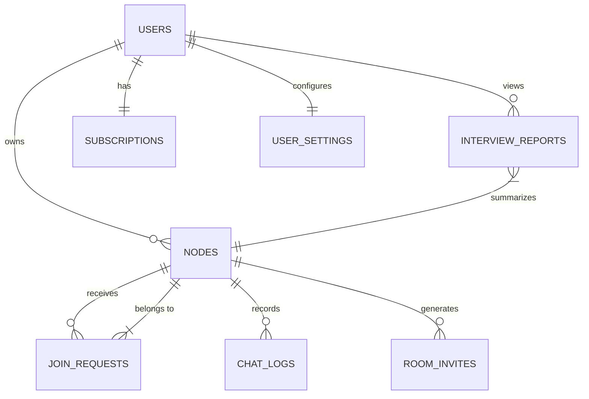

# Integra PRO | Database Architecture & Relationships

This document outlines the entity relationships for the Integra Forensic Intelligence system, specifically focusing on the integration of Deepfake detection as a "Gatekeeper" mechanism.

## 1. Entity Relationship Diagram (ERD)

## 2. Relationships Table

| Table | Relationship | Target Table | Foreign Key | Logic |
| :--- | :--- | :--- | :--- | :--- |
| **nodes** | Many-to-One | `auth.users` | `user_id` | Identifies the HR Owner who created the room. |
| **join_requests** | Many-to-One | `nodes` | `room_id` | Links a candidate to a specific interview session. |
| **interview_reports**| Many-to-One | `nodes` | `room_id` | Final forensic report generated for that session. |
| **interview_reports**| Many-to-One | `auth.users` | `user_id` | Allows HR to find all their previous candidate reports. |
| **chat_logs** | Many-to-One | `nodes` | `room_id` | Stores the transcript of a specific live session. |
| **subscriptions** | One-to-One | `auth.users` | `user_id` | Tracks credits and access limits for each HR account. |
| **user_settings** | One-to-One | `auth.users` | `user_id` | Personalizes the AI analysis (LLM keys, prompt overrides). |

## 3. Deepfake Data Flow

When a candidate attempts to join, the data flows as follows:

1.  **Candidate** hits `POST /api/verify-candidate`.
2.  **Backend** finds the `join_request` ID.
3.  **Engine** (`processor.py`) generates:
    -   `deepfake_score`: The % probability of manipulation.
    -   `liveness_status`: Verdict (Verified/Failed).
    -   `forensic_report_url`: Visual evidence of the analysis.
4.  **Database** updates the corresponding row in `join_requests`.
5.  **HR Dashboard** listens to the change via Realtime and displays the security badge.

---
*Created on: 2026-04-27*
